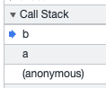

## 함수와 함수호출의 차이, 고차함수

> 함수의 호출은 `리턴값`으로 대체를 한다.

함수 선언식

```javascript
const add = (a, b) => a + b

function calculator(func, a, b) {
  return func(a, b)
}

add(3, 5) //8 함수 호출
calculator(add, 3, 5)
```

## 호출스택

> Stack = LIFO Queue = FIFO

```javascript
function c() {
  console.log('c')
}
function a() {
  console.log('a')
  function b() {
    console.log('b')
    c()
  }
  b()
}
a() // a b c
c() // c
```

호출스택 순서  
[anonoymous > a() > ~~log c~~ > b() > ~~log b~~ > c() > ~~log c~~ > ~~c()~~ > ~~b()~~ > ~~a()~~]



## 스코프 체인

> 스코프(범위)체인 `블록기준` 함수에서 어떤값에 접근이 가능한가?

## 호이스팅

변수선언하기 전에 접근하는 경우(TDZ) 자바스크립트는 호이스팅이 발생한다. TDZ를 피하는 코드를 작성하는 것을 권장한다.
